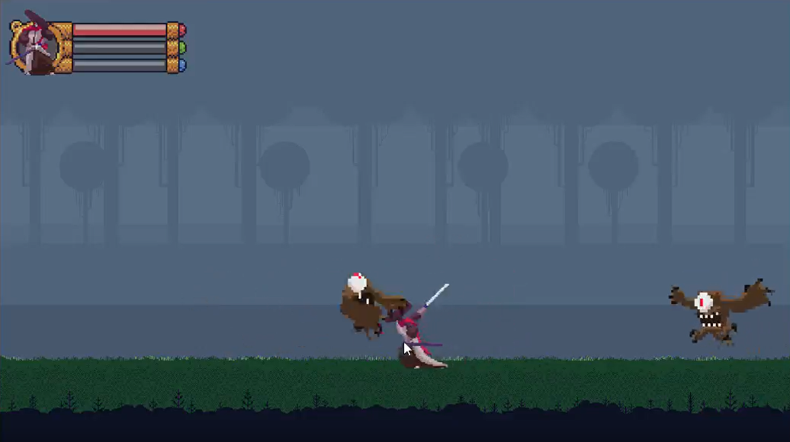

<h2 align="center">
   Game Side-Scrolling
</h2>

# About
Game developed during the Games at Unity course.
This is my first Side-Scrolling game, where the player's objective is to kill the monsters that appear on the screen.

# Tools
- Unity
- C#

## Layout
<figure>

  

</figure>
<figure>

  

</figure>
